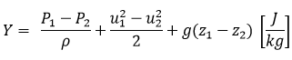
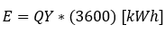

### Projeto do Aproveitamento

O projeto do aproveitamento consistirá na realização e apresentação de cálculos oriundos de dados de um dado aproveitamento hidrelétrico visando a instalação de uma usina hidrelétrica. Cada item deverá ser respondido neste documento do repositório, usando a ferramenta de edição.

  - Cada grupo terá em sua pasta do repositório um conjunto de dados de vazão que deverá ser usado ao longo deste e dos demais projetos quando necessário;
  
  - Modelamento do aproveitamento hidrelétrico. Cada grupo deverá mostrar como ficará o sistema hidromecânico equivalente através do cálculo da energia hidráulica média disponível e do trabalho específico. O grupo 1 deverá usar a  altura de cota **de 70 m** para seu aproveitamento hidrelétrico:
       
       + Considerando os princípios de conservação de massa e energia entre os níveis de montante e jusante, temos:
       
         Trabalho específico:
       
         
       
         Energia hidráulica média disponível: 
       
         

  - Determinação da queda do aproveitamento: O grupo 1 deverá considerar uma perda de **1,5 m**, onde cada grupo deverá especificar se a central será de baixa ou de alta queda;
       
  - Determinação da vazão média de longo tempo baseado nos dados de vazão dados a cada grupo. Cada grupo deverá mostrar como fez este cálculo e as hipóteses adotadas;
  
  - Cálculo da potência hidráulica máxima teórica média e da energia máxima teórica média;
  
  - Análise dos dados de vazão e energia máxima teórica média;
  
  - Escolha do tipo de central e o arranjo utilizado;
  
  - Estimativa da potência instalada;
  
  - Desenho esquemático do sistema hidromecânico equivalente;
  
  - Cada grupo deverá preencher uma ART (Anotação de Responsabilidade Técnica) para:

    - **Cargo e Função**, designando a tarefa de cada membro do grupo;
    - **Atuação**, designando os projetos a serem executados para a construção da usina;
    - **Obras e Serviços**, designando quais obras e serviços **relacionados a estudos, serviços e projetos civis** deverão ser executados para a construção da usina;

        Um arquivo de ajuda de preenchimento e um modelo de ART estão disponibilizados neste repositório. **Cada grupo deverá fazer suas ARTs baseado no modelo disponibilizado e fazer o *upload* para este repositório, sem recorrer a arquivos prontos na internet**;
        
- Projetos que não tiverem todos estes itens respondidos **não serão avaliados!**
Este projeto deverá ser feito neste arquivo, com o *upload* das respectivas ARTs, até o dia **02/09/2018**. Pedidos de adiamento só serão concedidos em casos excepcionais, a serem decididos pelo professor.

