### Projeto do Aproveitamento

O projeto do aproveitamento consistirá na realização e apresentação de cálculos oriundos de dados de um dado aproveitamento hidrelétrico visando a instalação de uma usina hidrelétrica. Cada item deverá ser respondido neste documento do repositório, usando a ferramenta de edição.

  - Cada grupo terá em sua pasta do repositório um conjunto de dados de vazão que deverá ser usado ao longo deste e dos demais projetos quando necessário;
  
  - Modelamento do aproveitamento hidrelétrico. Cada grupo deverá mostrar como ficará o sistema hidromecânico equivalente através do cálculo da energia hidráulica média disponível e do trabalho específico. O grupo 1 deverá usar a  altura de cota **de 70 m** para seu aproveitamento hidrelétrico:
       
       + Considerando os princípios de conservação de massa e energia entre os níveis de montante e jusante, temos:
       
         Trabalho específico:
       
         
       
         Energia hidráulica média disponível: 
       
         
	
       + Considerando que os reservatórios da montante e jusante estão sob a pressão atmosférica:
         
         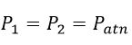       
         
       + Considerando que a velocidade na saída da usina é muito baixa e que velocidade na entrada é muito maior que a velocidade na saída:
	     
         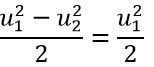       
       
       + Considerando que vazão turbinada será dividida em 4 condutos de 6,3 metro de diâmetro. Em cada contudo receberá uma vazão de 71,3 m^3/s, equivalente a ¼ da vazão média de 285,27 m^3/s. Esse arranjo de condutos foi baseando na Usina Hidroelétrica de Barra Grande, a qual possui um vazão semelhante a vazão de estudo do trabalho. Dessa forma pode-se encontrar a velocidade na entrada da turbina:

         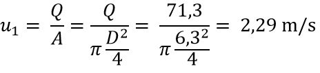
       
       + Considerando que z2 é a cota zero, z2=0.  
       
         De acordo com as considerações acima, temos: 
       
         Trabalho específico:
       
         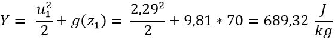
       
         Energia hidráulica média disponível: 
       
         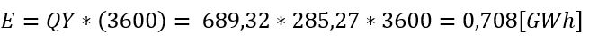
         

  - Determinação da queda do aproveitamento: O grupo 1 deverá considerar uma perda de **1,5 m**, onde cada grupo deverá especificar se a central será de baixa ou de alta queda;
  
         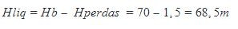
       
       
  - Determinação da vazão média de longo tempo baseado nos dados de vazão dados a cada grupo. Cada grupo deverá mostrar como fez este cálculo e as hipóteses adotadas;
  
  	+ A vazão média de longo período é a maior vazão possível de ser regularizada em uma bacia. Ela é definida como sendo a média das vazões anuais para toda a série de dados de vazão disponível para a bacia.
	+ Para realização do estudo foi utilizado uma série de dados de vazão diária da bacia com início em primeiro de janeiro de 1933 e com término em 31 de dezembro de 2013.
	+ Realizando a média aritmética simples destes valores foi calculado a vazão média de longo período. Considerando que todas as medidas disponíveis estão em metros cúbicos de água por segundo, a vazão média para a bacia é de 285,27 m³/s.
  
  - Cálculo da potência hidráulica máxima teórica média e da energia máxima teórica média;
  
  	+ A potência hidráulica máxima teórica média e a energia máxima teórica média representam o aproveitamento máximo possível para o curso hídrico. Tais grandezas podem ser obtidas pelas seguintes equações:
	
	  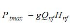
	  
	  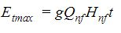
  
	+ Sendo, Qnf a vazão média de longo prazo e Hnf a queda do aproveitamento. Assim, podemos calcular a potência e a energia:
		
	  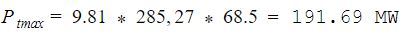
	  
	  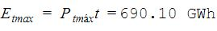
  
 
  - Análise dos dados de vazão e energia máxima teórica média;
  
       + Da análise dos dados de vazão do curso hídrico percebeu-se que a vazão varia consideravelmente no período atingindo uma valor mínimo de 4 m/s² e um valor máximo de 6912 m/s². Por está razão optou-se por utilizar um reservatório para armazenar o recurso hídrico e normalizar a vazão (torná-la constante e igual a vazão de longo período, regularizá-la). 
       + Da análise da energia máxima teórica e potência máxima teórica é superior a 30 MW de modo que a usina será classificada como usina hidrelétrica (UHE).

  
  - Escolha do tipo de central e o arranjo utilizado;
  
       + Devido a potência de aproveitamento encontrada anteriormente o tipo de central é Grande Central Hidrelétrica (GCH), neste documento será abordado GCH como sendo sinônimo de UHE. O arranjo definido para esse tipo de central é de represamento para permitir o armazenamento de recurso hídrico e normalizar a vazão.
  
  - Estimativa da potência instalada;
  
       + Em um projeto de dimensionamento, o melhor procedimento é fazer a potência instalada ficar o mais próximo possível da potência máxima. Como ainda faltam muitos parâmetros a serem dimensionados, a potência instalada será igualada a potência máxima calculada acima.    
  
  - Desenho esquemático do sistema hidromecânico equivalente;
       
       Sistema Hidromecânico Equivalente:
       
       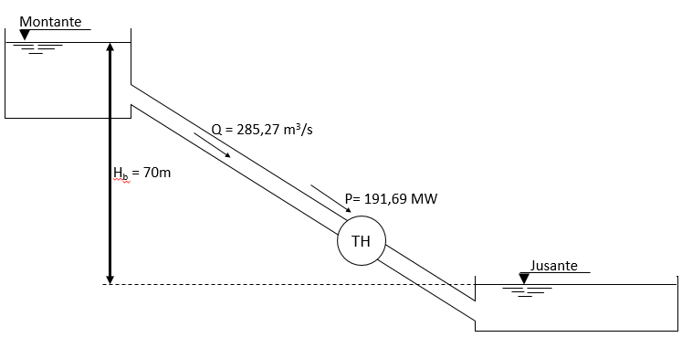
       
  
  - Cada grupo deverá preencher uma ART (Anotação de Responsabilidade Técnica) para:

    - **Cargo e Função**, designando a tarefa de cada membro do grupo;
    - **Atuação**, designando os projetos a serem executados para a construção da usina;
    - **Obras e Serviços**, designando quais obras e serviços **relacionados a estudos, serviços e projetos civis** deverão ser executados para a construção da usina;

        Um arquivo de ajuda de preenchimento e um modelo de ART estão disponibilizados neste repositório. **Cada grupo deverá fazer suas ARTs baseado no modelo disponibilizado e fazer o *upload* para este repositório, sem recorrer a arquivos prontos na internet**;
        
- Projetos que não tiverem todos estes itens respondidos **não serão avaliados!**
Este projeto deverá ser feito neste arquivo, com o *upload* das respectivas ARTs, até o dia **02/09/2018**. Pedidos de adiamento só serão concedidos em casos excepcionais, a serem decididos pelo professor.

