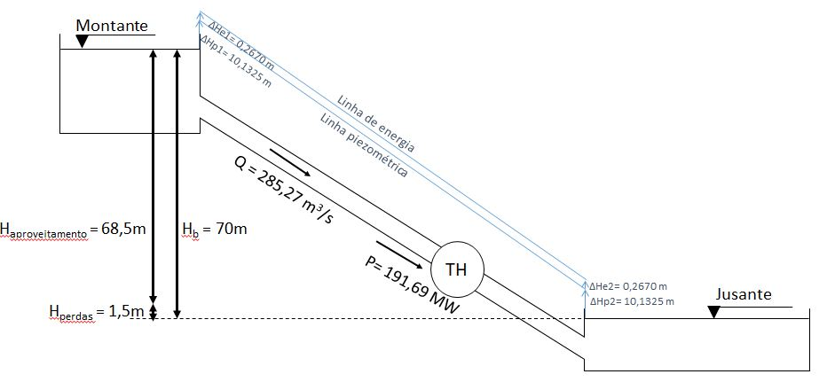
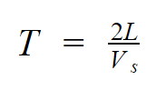
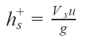
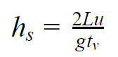
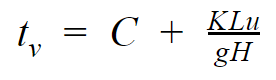
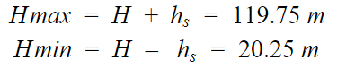

### Projeto do Conduto

O projeto do conduto consistirá na realização e apresentação de cálculos de condutos e canais para a central hidrelétrica. 

  - Projeto do canal para a futura usina hidrelétrica utilizando as fórmulas de Chezy, determinando de acordo com os dados de vazão de cada grupo:
     
       -A melhor forma geométrica de seção para o canal em questão;
       
       A forma Geométrica escolhida foi o condudo circular;
       
       Como sugerido no Projeto do Aproveitamento, temos 4 condutos de 6,3 metros de diâmetro. Cada contudo receberá uma vazão de 71,3 m^3/s, equivalente a ¼ da vazão média de 285,3 m^3/s. Considerando um conduto fechado temos uma velocidade de 2,3m/s;
       
       - O diâmetro hidráulico da seção;
       
       Partindo do equação de Chezy para cálculo da vazão:
       
       
       
       Temos que o coeficiente de Chezy C:
       
       
       
       Para facilitar os cálculos usaremos a correlação de Manning, onde C é:
       
       
       
       Onde n é parâmetro de rugosidade. O material para o construção do conduto do projeto é o aço liso que segundo a “Tabela 10.1 Valores experimentais do fator* n de Manning” do livro Mecânica dos Fluídos (WHITE, 1962), cujo o n = 0,012;
        
       α = 1,0 unidades do SI;

       Substituindo (3) em (1) e isolando Rh:
       
       
       
       A escolha do comprimento do conduto da tubulação considerou um critério para o não uso da instalação de chaminé de equilíbrio. De acordo com ELETROBRÁS (2000) o cociente entre o comprimento do conduto forçado com a queda bruta tem que ser menor ou igual a 5. Dessa forma, foi considerado o comprimento máximo:
       
       
        
       Com isso é possível calcular a inclinação S_0, mas primeiro é necessário definir o ângulo de inclinação:
       
       
        
       Dessa forma:
       
       
       
       Com esses dados pode-se calcular o Rh:
       
       
       
       E o Dh:
       
       
       
       - Velocidade da água no canal;
       
       Como definido acima, a velocidade no canal é de 2,3m/s;
          
       - Vazão de água no canal;
       
       Como definido acima, a vazão no canal é de 71,325m^2/s;
      
  - Baseado nos valores de queda dispostos no projeto do aproveitamento, o grupo deverá inserir no desenho esquemático deste projeto os seguintes itens:
        
       - Valores de cota de altura;
       - Alturas de queda;
       - Linhas piezométrica e de energia;
       
       Partindo das equações de Bernoulli, as linhas piezométrica e de energia serão traçadas. A linha de energia representa todos os termos da equação de Bernoulli, enquanto a linha piezométrica representa as componentes de pressão e elevação.
       O valor da variação da altura de montante ou à jusante para a cota piezométrica pode ser obtida pela equação:
       
       
       
       Como o escoamento ocorre em conduto livre, a pressão no ponto 1 é a mesma que no ponto 2, ou seja, pressão atmosférica à 101325 Pa. Logo, obtivemos o resultado:
       
       
        
       Para encontrar a diferença de cota entre a linha piezométrica e a linha de energia, basta calcular o termo de energia cinética dado pela equação:

       
       
       Considerando que o diâmetro do conduto é constante em todo o trajeto, não há variação da velocidade de escoamento. Ou seja, u1=u2 e

       
       
       Na figura abaixo estão traçadas as linhas piezométrica e de energia e as cotas de altura.
       
       
       
  - Determinação do semiperíodo da onda de pressão para dimensionamento do conduto fechado. Cada grupo poderá fazer as considerações que achar necessárias;
  
       Para realização dos cálculos da intensidade do golpe de aríete na tubulação será usado os valores de celeridade, velocidade constante do escoamento e comprimento do conduto já calculados anteriormente. Assim:

       + Vs= 647.745 m/s
       + u = 2.29 m/s
       + L = 350 metros
	
       A partir disto pode-se calcular o semi-período da onda de pressão que é dado pela equação:

       
        
       Inserindo os valores conhecidos na equação temos que o semi-período T é igual a 1.0806s.

       Caso o tempo de fechamento seja inferior a esse semi-período, haverá um golpe de ariete intenso que pode danificar a instalação. Assim, é importante calcular o máximo golpe de ariete positivo (que por definição possui o mesmo valor absoluto do máximo golpe de ariete negativo) de modo a projetar a tubulação para aguentar esta variação de pressão.
  
  - Determinação de valores de golpe de aríete positivo máximo;
  
       Para se calcular o máximo golpe de ariete usou-se a formulação de Allievi:
       
       
        
       Da equação temos que o máximo golpe de ariete positivo será de 151.2 metros. Vale ressaltar que o golpe de aríete é medido como uma queda adicional, por isso sua unidade é dada em metros.

       Por fim, se o tempo de fechamento da válvula for maior que o semi-período da onda de pressão, haverá uma redução no transiente de pressão o que resultará em um menor golpe de aríete.
  
  - Determinação de valores do golpe de aríete aceitável;
  
       Para determinação do golpe de aríete aceitável será usada a formulação de Michaeaud que é dada pela equação a seguir:
       
       
       
       Sendo tvigual ao tempo de fechamento da válvula.
       Para definição do tempo de fechamento da válvula foi utilizado o equacionamento de de Rosich simplificado que define a equação:

       
          
       Sendo C e K coeficientes tabelados que dependem do comprimento do conduto e da altura de queda. Para o caso estudado C será 0.95 (Coeficiente ligado a declividade) e K(coeficiente ligado a altura de recalque) será 2. Substituindo os valores nas equação temos que tvé igual a 3.28 s, o que é superior ao semi-período da onda de pressão e garante uma diminuição do golpe de aríete. 
       Aplicando a equação de Michaeaud temos que o hsé igual a 49.75 metros resultando em:

       
       
       Em todos os casos utilizou-se a queda bruta da usina, pois queremos encontrar os piores casos de golpe de aríete e assegurar que o conduto resistirá a eles.

  - Projetos que não tiverem todos estes itens respondidos ou que estiverem incompletos **não serão avaliados!**
Este projeto deverá ser feito neste arquivo até o dia **07/10/2018**. Pedidos de adiamento só serão concedidos em casos excepcionais, a serem decididos pelo professor.

  - REFERÊNCIAS
  
  WHITE, Frank M. Mecânica dos fluidos. McGraw Hill Brasil, 1962.
  
  ELETROBRÁS. Diretrizes para estudos e projetos de Pequenas Centrais Hidrelétricas, 2000.

