### Projeto do Conduto

O projeto do conduto consistirá na realização e apresentação de cálculos de condutos e canais para a central hidrelétrica. 

  - Projeto do canal para a futura usina hidrelétrica utilizando as fórmulas de Chezy, determinando de acordo com os dados de vazão de cada grupo:
     
       -A melhor forma geométrica de seção para o canal em questão;
       
       A forma Geométrica escolhida foi o condudo circular;
       
       Como sugerido no Projeto do Aproveitamento, temos 4 condutos de 6,3 metros de diâmetro. Cada contudo receberá uma vazão de 71,3 m^3/s, equivalente a ¼ da vazão média de 285,3 m^3/s. Considerando um conduto fechado temos uma velocidade de 2,3m/s;
       
       - O diâmetro hidráulico da seção;
       
       Partindo do equação de Chezy para cálculo da vazão:
       
       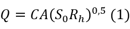
       
       Temos que o coeficiente de Chezy C:
       
       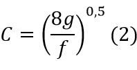
       
       Para facilitar os cálculos usaremos a correlação de Manning, onde C é:
       
       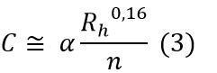
       
       Onde n é parâmetro de rugosidade. O material para o construção do conduto do projeto é o aço liso que segundo a “Tabela 10.1 Valores experimentais do fator* n de Manning” do livro Mecânica dos Fluídos (WHITE, 1962), cujo o n = 0,012;
        
       α = 1,0 unidades do SI;

       Substituindo (3) em (1) e isolando Rh:
       
       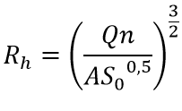
       
       A escolha do comprimento do conduto da tubulação considerou um critério para o não uso da instalação de chaminé de equilíbrio. De acordo com ELETROBRÁS (2000) o cociente entre o comprimento do conduto forçado com a queda bruta tem que ser menor ou igual a 5. Dessa forma, foi considerado o comprimento máximo:
       
       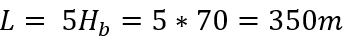
        
       Com isso é possível calcular a inclinação S_0, mas primeiro é necessário definir o ângulo de inclinação:
       
       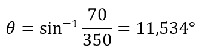
        
       Dessa forma:
       
       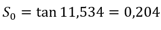
       
       Com esses dados pode-se calcular o Rh:
       
       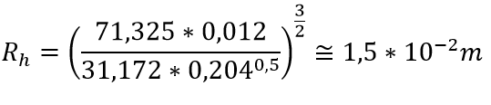
       
       E o Dh:
       
       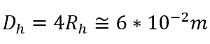
       
       - Velocidade da água no canal;
       
       Como definido acima, a velocidade no canal é de 2,3m/s;
          
       - Vazão de água no canal;
       
       Como definido acima, a vazão no canal é de 71,325m^2/s;
      
  - Baseado nos valores de queda dispostos no projeto do aproveitamento, o grupo deverá inserir no desenho esquemático deste projeto os seguintes itens:
        
       - Valores de cota de altura;
       - Alturas de queda;
       - Linhas piezométrica e de energia;
       
       Partindo das equações de Bernoulli, as linhas piezométrica e de energia serão traçadas. A linha de energia representa todos os termos da equação de Bernoulli, enquanto a linha piezométrica representa as componentes de pressão e elevação.
       O valor da variação da altura de montante ou à jusante para a cota piezométrica pode ser obtida pela equação:
       
       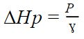
       
       Como o escoamento ocorre em conduto livre, a pressão no ponto 1 é a mesma que no ponto 2, ou seja, pressão atmosférica à 101325 Pa. Logo, obtivemos o resultado:
       
       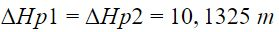
        
        Para encontrar a diferença de cota entre a linha piezométrica e a linha de energia, basta calcular o termo de energia cinética dado pela equação:

       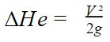
       
       Considerando que o diâmetro do conduto é constante em todo o trajeto, não há variação da velocidade de escoamento. Ou seja, u1=u2 e

       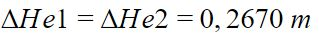
       
       Na figura abaixo estão ilustradas as linhas piezométrica e de energia e as cotas de altura.
       
       
  - Determinação do semiperíodo da onda de pressão para dimensionamento do conduto fechado. Cada grupo poderá fazer as considerações que achar necessárias;
  
  - Determinação de valores de golpe de aríete positivo máximo;
  
  - Determinação de valores do golpe de aríete aceitável;
  
  - Projetos que não tiverem todos estes itens respondidos ou que estiverem incompletos **não serão avaliados!**
Este projeto deverá ser feito neste arquivo até o dia **07/10/2018**. Pedidos de adiamento só serão concedidos em casos excepcionais, a serem decididos pelo professor.

  - REFERÊNCIAS
  
  WHITE, Frank M. Mecânica dos fluidos. McGraw Hill Brasil, 1962.
  
  ELETROBRÁS. Diretrizes para estudos e projetos de Pequenas Centrais Hidrelétricas, 2000.

