### Projeto da Turbina

O dimensionamento preliminar de uma turbina consistirá em determinar e dimensionar uma turbina para uma dado aproveitamento hidrelétrico. 

  - Cada grupo deverá especificar qual devem ser a potência e vazão da turbina a ser projetada, baseados nos cálculos dos projetos anteriores;
  
    + Dos projetos anteriores, calculou-se que a vazão de projeto para a usina será de 285,3 m³/s e definiu-se que haverá 4 condutos que captarão a água do reservatório e a conduzirão as turbinas. Desse modo a usina possuirá cinco turbinas, cada uma ligada a um conduto e uma sobressalente, com mesma potência e vazão de alimentação. A quinta turbina é uma medida de contingência para os momentos de manutenção e para o caso de alguma das turbinas principais apresentar um defeito.
    + Cada turbina terá vazão de 71,325 m³/s, ou seja, um quarto da vazão de projeto.
    + Do projeto de aproveitamento, calculou-se a potência máxima obtendo um valor de 191.69 MW e definiu-se que a potência instalada será igual a potência máxima do recurso hídrico. Além disso, cada turbina será dimensionada para gerar um quarto da potência total.
    + Deste modo, cada turbina terá a potência de 47.93 MW.
  
  - Estime a rotação nominal da turbina, considerando um gerador com 10 pólos e frequência de corrente de 60 Hz;
  
    + A rotação nominal da turbina pode ser calculada pela seguinte equação:
    
         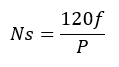
         
         Figura 1: Equação para definir a rotação nominal.
         
    + Sendo P o número de pares de polos que na questão será 5.                                      
    + Utilizando está equação e os dados conferidos temos que a rotação nominal será de 1440 RPM.
  
  - Para um modelo reduzido de 0,075 m de diâmetro, estime qual deve ser a razão de escala geométrica necessária para se obter os valores de potência e vazão determinados no primeiro item;
  
    + Para definir a razão de escala geométrica é necessário definir os parâmetros construtivos da turbina a ser utilizada. Assim, para obtenção da potência requerida foi definido que a turbina apresentará:
    
       +Diâmetro externo de 4.5 metros e diâmetro interno de 0.42 metros (d2 e d1 respectivamente).
       
       +Largura de pá de 0.05 metros na base e 0.03 no topo (b1 e b2 respectivamente).
       
       +Rotação nominal de 116.13 rpm resultando em 62 pares de polos (n).
       
       +Angulo de pá de 15°(beta 2).
       
       +Velocidade de entrada de 2.28 m/s (Vn1).
       
    + Assim a potência no eixo (considerando um rendimento de 95% da conversão mecânica para elétrica) será dado por:
    
         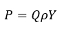
    
         Figura 2: Potência de eixo.
    
    + Temos a vazão, a massa específica da água e a potência, assim isolando Y encontramos que seu valor deve ser de 707,36 J/kg.
    + Y pode ser calculado a partir da equação a seguir:
    
         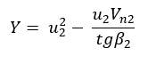
    
         Figura 3: Trabalho específico.
    
    + A partir dos parâmetros construtivos da turbina é possível calcular u2 e Vn2 através das equações:
    
         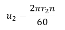
                                  
         Figura 4: Calculo de u2.
                                          
         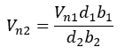
                                          
         Figura 5: Calculo de Vn2.
                                          
    + Tais velocidades são parâmetros do triângulo de velocidades da turbina e serão melhores apresentados no tópico seguinte.
    
    + Substituindo os parâmetros contrutivos nas equações é possível calcular Y e ver que ele é igual a 712.4878 J/kg. Um pouco mais que o requerido, fazendo que a turbina a presente a potência levemente superior a definida do tópico 1 (48.27 MW contra 47.93 definido), porém não há problema, este valor será usado como coeficiente de segurança.
    
    + Por fim a razão de segurança é definida como a razão entre o diâmetro do protótipo pelo diâmetro do modelo e terá valor de 60.
  
  - Mostre o triângulo de velocidades para estas condições para turbinas Kaplan, Francis e Pelton. Faça as considerações que achar necessárias e explique-as;
  
  Para a turbina Kaplan temos as seguintes considerações:

   + Vamos considerar saída meridional (fluxo axial);
   +Diâmetro externo de 4.5 metros e diâmetro interno de 0.42 metros (d2 e d1 respectivamente);
   +Rotação nominal de 1440 rpm resultando em 5 pares de polos (n);
   +Vazão de 71,325 m³/s.
        
  Assim, no Hub temos:
  
  Podemos determinar a área por onde o fluido escoa pela seguinte equação:
    
   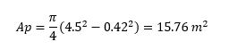
    
   Podemos determinar a velocidade média pela seguinte equação:
   
   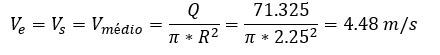
    
   Agora é possível determinar o triângulo de velocidades. Temos que Uhub, pode ser determinada pela seguinte equação:
    
   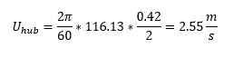
   
   Podemos determinar a velocidade Vt1 pela seguinte equação:

   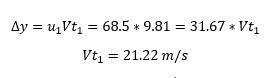
   
   Podemos determinar o angulo B1 pela seguinte equação:
   
   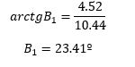
   
   Podemos determinar o B2 pela seguinte equação:
   
   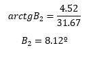
   
   Assim, temos os triângulos de velocidades :

  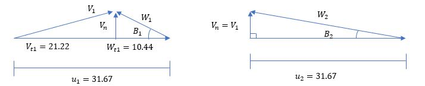

  
  - Determine a rotação específica e classifique a turbina como lenta, rápida ou extra-rápida;
  
  - Estime a velocidade de disparo da turbina;
  
     + Velocidade de disparo é a situação onde a rotação da turbina é máxima, quando o gerador é retirado do sistema e o distribuidor continua em abertura plena (NOLETO, 2017).
     
     + A partir da aplicação de Bernoulli na entrada e na saída do bocal, essa velocidade é obtida como:
    
       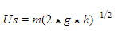
        
    Figura x: Calculo da velocidade de disparo.
     
     + Como o fluido é água, a massa é 0,97 kg/m³ e a gravidade 9,81 m²/s então, a velocidade de disparo da turbina possui velocidade de:
     
       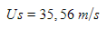
        
    Figura x: Valor da velocidade de disparo.
  
  - Estime o fator de capacidade;
  
     + O fator de capacidade é a relação entre a energia efetivamente gerada 𝐸ú𝑡𝑖𝑙 e a energia gerada caso a central trabalhe todo o tempo em potência plena 𝐸𝑡𝑜𝑡𝑎𝑙. Este fator indicará a adequação entre a vazão de projeto e as vazões disponíveis, é dado por (NOLETO, 2018):
     
       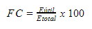
        
    Figura x: Calculo do fator da capacidade.
    
     + Sabendo que a energia é dada pelo produto da potência pelo tempo e utilizando os dados adquiridos no projeto de aproveitamento, tomando a potência máxima como a potência total, temos:

       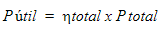
        
    Figura x: Calculo da potência útil.
    
    Onde:
    
       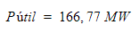
    
       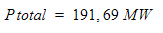
    
     + Logo, o valor de fator de capacidade da usina hidrelétrica é 

       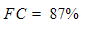
        
  - Qual é o tipo de turbina mais adequado para este aproveitamento?
  
  - Se for o caso, determine a altura de sucção e diga se existe risco de cavitação;
  
  - Com os cálculos, a usina que conterá esta turbina será classificada como? (Pequena central hidrelétrica, Grande central hidrelétrica, etc.)
  
  - Projetos que não tiverem todos estes itens respondidos ou que estiverem incompletos **não serão avaliados!**

Os dados faltantes poderão ser estimados pelo grupo, desde que a forma de estimativa seja devidamente explicada. É facultada a utilização de ferramentas computacionais. Este projeto deverá ser feito neste arquivo até o dia **25/11/2018**. Pedidos de adiamento só serão concedidos em casos excepcionais, a serem decididos pelo professor.

